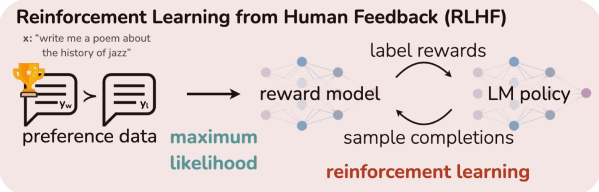
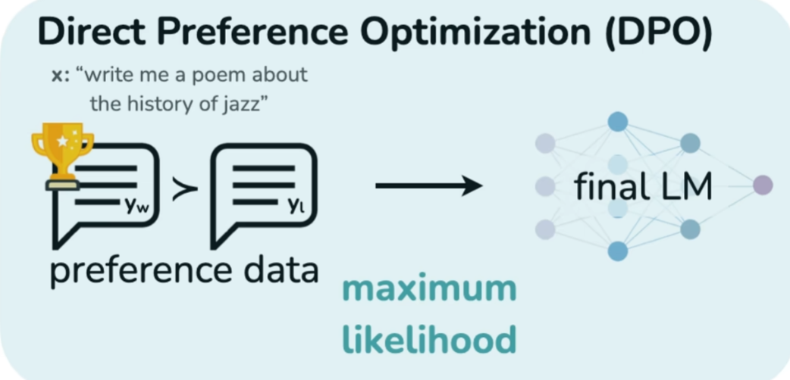
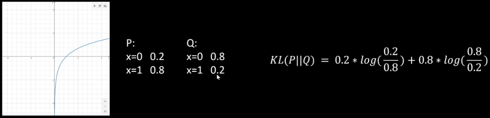

# DPO算法讲解

我们知道在对大语言模型进行强化学习的时候，首先我们先需要收集大量的用户偏好数据，也就是对于同一个询问，让大语言模型给出两个不同的回答，然后让用户选择出哪一个更好，再用极大似然估计的方法训练一个reward model，它可以在输入prompt和大语言模型回答时，给回答进行打分，打分越高表明大语言模型的回答越好，越接近人类的偏好，有了这个reward model我们就可以用强化学习来训练我们的大语言模型

而DPO算法大大简化了这一过程，它可以直接从用户的偏好数据中学习、训练我们的大语言模型，让它更接近人类的偏好。

## KL散度 KL Divergence

首先我们要了解一下KL散度，P相对于Q的KL散度的计算公式为：
$$
KL(P||Q)=\sum_{x\in X}P(x)\log(\frac{P(x)}{Q(x)})
$$
P分布相对于Q分布的相似程度。根据一个事件x，事件x在P分布的概率除以事件x在Q分布的概率，然后取对数，再取数学期望。

KL散度的值大于等于0，P和Q越相似，KL散度越接近0，如果P和Q分布完全一致，KL散度等于0

KL(P||Q)!=KL(Q||P)

## Bradley-Terry模型

BradleyTerry模型是对比较关系进行建模

| 对战 | 胜   | 负   |
| ---- | ---- | ---- |
| A对B | 8    | 4    |
| A对C | 3    | 5    |

问题：B战胜C的概率有多大？

BradleyTerry假设每个元素都有一个隐含的实力参数$\alpha_i$，它大于0，元素i战胜元素j 的概率可以用：
$$
P(i>j)=\frac{\alpha_i}{\alpha_i+\alpha_j}
$$
来表示，这个表达式非常符号直觉，如果i和j的实力相等，那么$\frac{\alpha_i}{\alpha_i+\alpha_j}$就等于0.5，如果i的实力小于j的实力，那么$\frac{\alpha_i}{\alpha_i+\alpha_j}$就小于0.5

极大似然估计：

A和B：A获胜概率为$\frac{\alpha_A}{\alpha_A+\alpha_B}$，B获胜的概率为$\frac{\alpha_B}{\alpha_A+\alpha_B}$，A获胜8次，B获胜4次，联乘概率为$(\frac{\alpha_A}{\alpha_A+\alpha_B})^8(\frac{\alpha_B}{\alpha_A+\alpha_B})^4$

A和C：A获胜概率为$\frac{\alpha_A}{\alpha_A+\alpha_C}$，B获胜的概率为$\frac{\alpha_C}{\alpha_A+\alpha_C}$，A获胜3次，B获胜5次，联乘概率为$(\frac{\alpha_A}{\alpha_A+\alpha_C})^3(\frac{\alpha_C}{\alpha_A+\alpha_C})^5$

总连乘概率也就是总体似然L为$(\frac{\alpha_A}{\alpha_A+\alpha_B})^8(\frac{\alpha_B}{\alpha_A+\alpha_B})^4$$(\frac{\alpha_A}{\alpha_A+\alpha_C})^3(\frac{\alpha_C}{\alpha_A+\alpha_C})^5$，我们对两边取ln
$$
\ln L=8 \ln ( \frac{\alpha_A}{\alpha_A+\alpha_B} ) + 4 \ln ( \frac{\alpha_B}{\alpha_A+\alpha_B} ) + 3 \ln ( \frac{\alpha_A}{\alpha_A+\alpha_C} ) + 5 \ln ( \frac{\alpha_C}{\alpha_A+\alpha_C} )\\
$$
表达式一共四个部分，$8 \ln ( \frac{\alpha_A}{\alpha_A+\alpha_B} )$表示A战胜B 8次，$4 \ln ( \frac{\alpha_B}{\alpha_A+\alpha_B} )$表示B战胜A 4次，$3 \ln ( \frac{\alpha_A}{\alpha_A+\alpha_C} )$表示A战胜C 3次，$5 \ln ( \frac{\alpha_C}{\alpha_A+\alpha_C} )$表示C战胜A 5次，我们分别对$\alpha_A \alpha_B \alpha_C$求导，导数等于0时取得最大值（因为对数似然是凹的，驻点必是全局最大），例如：
$$
\frac{\partial}{\partial \alpha_A}\,\ln L
   = \frac{8}{\alpha_A}
     - \frac{8+4}{\alpha_A+\alpha_B}
     + \frac{3}{\alpha_A}
     - \frac{3+5}{\alpha_A+\alpha_C}.
$$
假设我们计算出来$\alpha_A \alpha_B \alpha_C$分别为：
$$
\alpha_A=1 \ \ \ \ \ \ \alpha_B=\frac{1}{2} \ \ \ \ \ \ \alpha_C=\frac{5}{3}  \ \ \ \ \ \  \ \ \ \ \ \ 
$$
就可以得到B战胜C的概率：
$$
P(B>C)=\frac{\alpha_B}{\alpha_B+\alpha_C}≈0.23
$$
如果我们不想对$\alpha_A \alpha_B \alpha_C$直接求导获取最大值，我们也可以通过优化器进行迭代优化来进行求解，这时我们可以定义一个loss函数，loss函数越小越好，所以我们加上负号，
$$
Loss=- E_{(\alpha_x,\alpha_y)\sim D}[\ln \frac{\alpha_x}{\alpha_x+\alpha_y}]
$$
上述公式表示，在一个数据集D中，每条样本给出一对实力参数$\alpha_x$和$\alpha_y$，把数据集中的每条样本都代入$\ln \frac{\alpha_x}{\alpha_x+\alpha_y}$，然后求平均。

通过这样的转换，我们可以看到，这实际就是一个分类问题的交叉熵损失函数，其中$\frac{\alpha_x}{\alpha_x+\alpha_y}$表示x战胜y的概率，这个优化的目标就是让x战胜y的概率越趋近于1越好，

我们再来总结一下BradleyTerry模型

强化学习里：

大模型输入的prompt是x，回答是y。回答y的好坏（实力得分）是靠reward模型来评估
$$
P(y_1 > y_2) = \frac{r(x,y_1)}{r(x,y_1)+r(x,y_2)}
$$
$r(x,y)$可能是负数，所以要加上指数函数：
$$
P(y_1 > y_2) = \frac{\exp (r(x,y_1))}{\exp (r(x,y_1))+\exp (r(x,y_2))}
$$
我们已经知道大语言模型给出$y_w$优于$y_l$的概率为：
$$
P(y_w > y_l) = \frac{\exp (r(x,y_w))}{\exp (r(x,y_w))+\exp (r(x,y_l))}
$$
我们也知道sigmod函数表达式为：
$$
\sigma(x)=\frac{1}{1+\exp (-x)}
$$
我们对loss函数ln中的分子和分母同时除以分子，我们可以看到ln函数内部其实是一个sigmod函数，我们用sigmod函数进行化简，
$$
Loss=- E_{(x,y_w,y_l)\sim D}[\ln  \frac{\exp (r(x,y_w))}{\exp (r(x,y_w))+\exp (r(x,y_l))}]\\
=- E_{(x,y_w,y_l)\sim D}[\ln  \frac{1}{1+\exp (r(x,y_l)-r(x,y_w))}]\\
=- E_{(x,y_w,y_l)\sim D}[\ln \sigma( r(x,y_w) - r(x,y_l)) ]
$$
最终得到loss函数的简化表达
$$
-\ln \sigma (r(x,y_w)-r(x,y_l))
$$
上述公式表示最终的loss为（$y_w$样本的得分-$y_l$样本的得分）通过sigmod函数后再去ln，最后再取负值。

这个loss函数的目标，就是优化大语言模型输出的$y_w$通过reward方法的得分尽可能大于$y_l$通过reward方法的得分，有了这些准备我们就可以进行DPO的训练了。

## DPO的训练目标

DPO由以下几个部分组成

奖励函数：r(x,y)     	x:prompt，y:response，奖励模型可以根据x和y进行打分，给出这个回答的好坏

基准模型：$\pi _{ref}(y|x)$	一般是sft之后的大语言模型

训练模型：$\pi(y|x)$
$$
\max_\pi \textcolor{blue}{E_{x \sim D,y \sim \pi}[r(x,y)]} - \textcolor{green}{\beta} \textcolor{orange}{D_{KL}[\pi (y|x) || \pi _{ref}(y|x)]}
$$
DPO的训练目标是尽可能得到更多的$\textcolor{blue}{训练奖励，也就是reward的期望}$，同时保证$\textcolor{orange}{新训练的模型和基准模型的输出分布一致}$，$\textcolor{green}{\beta}$参数可以调节，它越大表示新训练的模型应当尽可能和基准模型分布保持一致，这里用KL散度来约束我们训练的模型应当尽可能和基准模型保持一致，

我们有了训练目标，现在对其进行一步步化简：
$$
\max_\pi E_{x \sim D,y \sim \pi}[r(x,y)] - \beta D_{KL}[\pi (y|x) || \pi _{ref}(y|x)]\\
=\max_\pi E_{x \sim D,y \sim \pi}[r(x,y)] - E_{x \sim D,y \sim \pi}[\beta \log \frac{\pi (y|x)}{ \pi _{ref}(y|x)}](1)\\
=\max_\pi E_{x \sim D,y \sim \pi}[ r(x,y)-\beta \log \frac{\pi (y|x)}{ \pi _{ref}(y|x)}](2)\\
=\min_\pi E_{x \sim D,y \sim \pi}[ \log \frac{\pi (y|x)}{ \pi _{ref}(y|x)} - \frac{1}{\beta} r(x,y)](3)\\
=\min_\pi E_{x \sim D,y \sim \pi}[ \log \frac{\pi (y|x)}{ \pi _{ref}(y|x)} - \log \exp ( \frac{1}{\beta} r(x,y) )](4)\\
=\min_\pi E_{x \sim D,y \sim \pi}[ \log \frac{ \pi (y|x) } { \pi _{ref}(y|x) \exp ( \frac{1}{\beta} r(x,y) ) }](5)\\
=\min_\pi E_{x \sim D,y \sim \pi}[ \log \frac{ \pi (y|x) } { \pi _{ref}(y|x) \exp ( \frac{1}{\beta} r(x,y) ) \frac{1}{Z(x)} Z(x) }](6)\\
=\min_\pi E_{x \sim D,y \sim \pi}[ \log \frac{ \pi (y|x) } { \textcolor{orange}{\frac{1}{Z(x)} \pi _{ref}(y|x) \exp ( \frac{1}{\beta} r(x,y) )} } - \log Z(x)](7)\\
\\
\\
Z(x)=\sum_y \pi_{ref}(y|x) \exp (\frac{1}{\beta} r(x,y ))(8)\\
\textcolor{orange}{\frac{1}{Z(x)} \pi _{ref}(y|x) \exp ( \frac{1}{\beta} r(x,y) )=\frac{\pi _{ref}(y|x) \exp ( \frac{1}{\beta} r(x,y) )}{\sum_{y}\pi _{ref}(y|x) \exp ( \frac{1}{\beta} r(x,y) )}=\pi^*(y|x)}(9)\\
\\
\\
=\min_{\pi} E_{x \sim D, y \sim \pi}[\log \frac{\pi(y|x)}{\pi^{*}(y|x)} - \log Z(x)](10)\\
=\min_{\pi} E_{x \sim D, y \sim \pi}[\log \frac{\pi(y|x)}{\pi^{*}(y|x)}](11)\\
=\min_{\pi} E_{x \sim D} [D_{KL}(\pi (y|x) || \pi^{*} (y|x))](12)\\
\\
\pi(y|x)=\pi^{*}(y|x)=\frac{1}{Z(x)} \pi _{ref}(y|x) \exp ( \frac{1}{\beta} r(x,y) )(13)
$$
（1）首先写出KL散度的完整表达式

（2）然后将期望提取到前面，这里就变成了每一个样本的（reward-KL散度）的期望

（3）然后把求最大值加上符号变成求最小值，同时里面表达式同时除以$\beta$，

（4）然后对后面的项，先求指数运算，再求对数运算

（5）对数相减转换成内部元素相除

（6）在分母上乘以Z(x)再乘以一个Z(x)

（7）把Z(x)提取出来

（8）这是Z(x)的表达式，表示基准网络分布*

我们先看一下优化到这一步的分母部分，里面有个Z(x)，表达式如（8），

（9）我们把Z(x)代入，可以看得到，分母：这是在给定一个x的情况下，对所有可能的y进行求和，分子：其中一个特定的y。也就是说分母是各种y的情况，分子是特定y的情况。这就是一个概率分布，我们可以用$\pi^*(y|x)$来表示这个概率分布，然后替换到（7）中得到（10）

（10）这里是通过$\pi$网络来求（10）的最小，而我们看到Z(x)中并没有$\pi$，所以Z(x)并不影响我们的最小值优化，可以直接去掉得到（11）

（11）这实际上就是$\pi$相对于$\pi^*$分布的kl散度的表示，，然后我们使用KL散度来表示得到（12）

（12）这样我们的优化目标就变成了让这个KL散度尽可能小，之前我们已经说过KL散度是一个大于等于0的数，最小是等于0，意味着$\pi$和$\pi^*$的分布完全相同

（13）所以我们的优化目标就变成了我们要训练的神经网络$\pi$的输出的分布应该等于$\pi^*$，也就是$\frac{1}{Z(x)} \pi _{ref}(y|x) \exp ( \frac{1}{\beta} r(x,y) )$

所以到这一步我们可以得到我们要训练网络$\pi$，它的表达式为$\frac{1}{Z(x)} \pi _{ref}(y|x) \exp ( \frac{1}{\beta} r(x,y) )$
$$
\pi(y|x)=\frac{1}{Z(x)} \pi _{ref}(y|x) \exp ( \frac{1}{\beta} r(x,y) )(1)\\
\Rightarrow \exp( \frac{1}{\beta} (x|y) )=\frac{\pi(y|x)}{\pi_{ref}(y|x)} Z(x)(2)\\
\Rightarrow r(x,y)=\beta \ln ( \frac{\pi(y|x)}{\pi_{ref}(y|x)} Z(x) )(3)\\
\Rightarrow r(x,y)=\beta \ln \frac{\pi(y|x)}{\pi_{ref}(y|x)} + \beta \ln Z(x) (4)\\
\\
\textcolor{orange}{-\ln \sigma (r(x,y_w) - r(x,y_l))}(5)\\
=-\ln \sigma( \beta \ln \frac{\pi(y_w|x)}{\pi_{ref}(y_w|x)} + \beta \ln Z(x) - \beta \ln \frac{\pi(y_l|x)}{\pi_{ref}(y_l|x)} - \beta \ln Z(x) )(6)\\
=-\ln \sigma( \beta \ln \frac{\pi(y_w|x)}{\pi_{ref}(y_w|x)} - \beta \ln \frac{\pi(y_l|x)}{\pi_{ref}(y_l|x)} )(7)
$$
（1）通过表达式两边进行变换得到（2）

（2）从而可以求解reward function的表达式（3）

（3）把Z(x)提取出来得到（4）

（4）

（5）之前我们也通过BradleyTerry模型知道如何对比较关系进行建模，它的loss函数为（5）

（6）这样我们就可以得到最终的loss函数的表达式，我们可以看到$+\beta \ln Z(x)和$$-\beta \ln Z(x)$这两个部分是可以化简掉的

（7）这样我们就得到了最终DPO的loss函数（7），其中$\sigma(x)=\frac{1}{1+\exp(-x)}$

对比以下我们的BradleyTerry损失函数
$$
-\ln \sigma (r(x,y_w)-r(x,y_l))
$$
不难发现，对于真实的大模型$\pi$和$\pi_{ref}$而言，BradleyTerry损失函数中的$reward(x,y_w)$被替换成了 $\beta \ln \frac{\pi(y_w|x)}{\pi_{ref}(y_w|x)}$，$reward(x,y_l)$被替换成了 $\beta \ln \frac{\pi(y_l|x)}{\pi_{ref}(y_l|x)}$，就作为优化$\pi$的损失函数即可。

在工程实现中有一个注意点：
$$
-\ln \sigma( \beta \ln \frac{\pi(y_w|x)}{\pi_{ref}(y_w|x)} - \beta \ln \frac{\pi(y_l|x)}{\pi_{ref}(y_l|x)} )\\
=-\ln \sigma( \beta (\ln {\pi(y_w|x)}- \ln{\pi_{ref}(y_w|x)}) - \beta (\ln {\pi(y_l|x)}-\ln{\pi_{ref}(y_l|x)}) )\\
=-\ln \sigma( \beta (\ln {\pi(y_w|x)}- \ln {\pi(y_l|x)}) - \beta (\ln{\pi_{ref}(y_l|x)}-\ln{\pi_{ref}(y_w|x)}) )
$$
