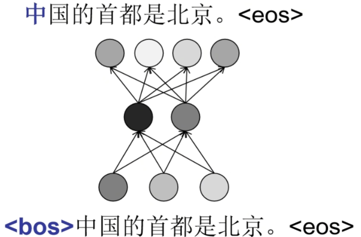
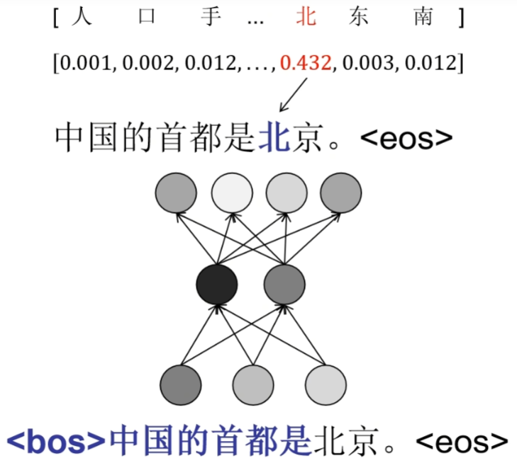
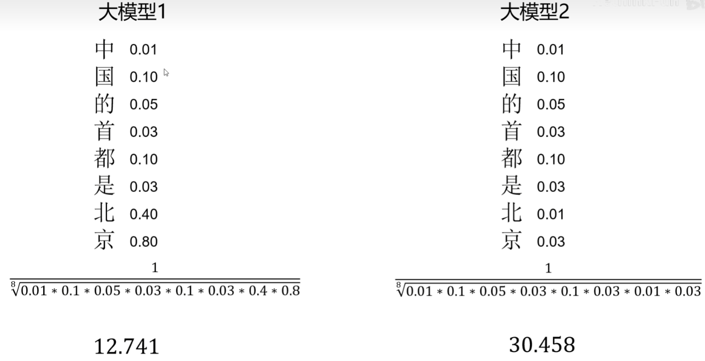

如何对我们训练好的大模型进行评价呢？

## 一、困惑都指标Perplexity/PPL

回忆一下大模型的推理过程，以“中国的首都是背景“这句话为例，我们希望

输入句子起始符，模型输出”中“；

输入起始符和”中“，模型输出”国“；

输入起始符和”中“和”国“，模型输出”的“；

模型在输出每个字的时候，实际上会给出字典里的每个字的概率值，比如这里”北“字的概率为0.432，

对于整句话，可以计算出来一个困惑度，那就是对于每个我们期望出现的字，当时大模型给出的概率值的连称再开方，然后取倒数就是困惑度，我们对比这两个模型，第一个模型前面这些字的概率都比较低，但是到了北京这两个字概率很高，因为根据前面”中国的首都是“，模型加上自己的知识判断这里大概率是北京，而第二个模型自己内部的知识比较差，不知道中国的首都在哪里，所以北京这两个字概率也很低，所以第二个模型的困惑度就高于第一个模型，

困惑度的计算中概率连乘比较好理解，就是输出正确的联合概率，为什么要开方呢？这是为了让困惑度指标不受句子长度影响，连乘次数越多，开方也就越大，抵消了连乘，为什么要取倒数呢？因为概率连乘其实表示的是确信度，确信度的倒数才能被称为困惑度，困惑度越大表示模型生成的文本和我们测试的文本分布越一致

但是实际中计算困惑度使用的是以下公式
$$
PPL(X)=exp\{-\frac{1}{t}\sum^{t}_{i}\log p_\theta(x_i|x_{<i})\}
$$
先取对数再取指数，看起来是多此一举，这是因为很多小概率值连乘会发生数值过小，向下溢出的情况，这里改成先取对数连加再取平均，最后再取指数的形式，这样和刚才计算的结果是一致的，但是再用计算机进行计算时数值更稳定，

困惑度只能反映模型输出是否类似于测试文本，如果你训练一个写作模型，测试的文本都是网络小说，但是模型的写作水平已经达到了顶尖作家的水平，那分布肯定和网络小说是不同的，困惑度的值很高，但是此时的模型性能却很优秀，所以第二种对大模型的评测方法时人工测评

## 二、人工测评

我们可以把不同模型的输出打乱，让测试者选出哪个回答更好，以此来决定哪个模型的性能更优，但是这样的人力成本太高了，而且测试结果受个人影响太大了，所以就出现第三种，制定可解析的测评集

## 三、可解析测评集

比如出一道题，让模型只能输出abcd选项中的一个，解析模型给出的答案，从而对模型能力进行测评，不光是选择题，也可以是其他可解析的结果，比如问大模型是谁统一了六国，答案必须是人名且以json格式输出，这样再用程序解析模型的输出，也可以对模型的表现进行定量的评估，目前用于通用模型能力可解析的公开测评集有很多，介绍几个常用的

MMLU：包含人文、社会科学、自然科学等57中任务。

MMLU-PRO：MMLU增强版的数据集，旨在通过整合更具有挑战性、注重推理的问题，并将选项数从四个扩展到十个。

IFEVAL：instruction_following_eval通过“可验证”的指令，测试模型指令遵从能力。

BBH：BIG-Bench Hard 23个具有挑战的任务，这些任务是那些之前的语言模型评估没有超越人类平均评分的任务。

MATH：包含12500个具有挑战性的竞赛数学问题，每个问题都有详细的逐步解决方案，可以用来教导模型生成答案的推导和解释。

GPQA：是一个由生物学、物理学和化学领域的专家编写的具有挑战性的数据集，包含448道多选题。确保这些问题具有高质量且极具难度，在相应领域拥有或者正在攻读博士学位的专家达到了65%的准确率（如果排除专家时候识别出的明显错误，则为74%），而高技能的非专家验证者在平均超过30分钟的无限制网络访问时间内，仅达到34%的准确率（这些问题具有防谷歌特性）。

我们也可以根据项目定制自己的测试集（固定答案或者选择题），可以通过程序解析，给出模型评价。

## 四、大模型评测

对于不好定义可解析测试集的情况下，比如写诗大模型，可以利用其他大模型来进行打分评价。