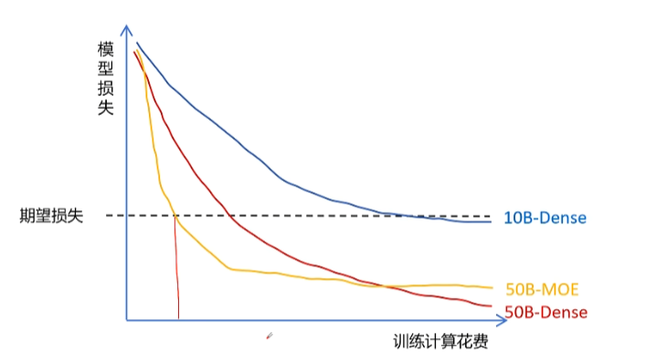
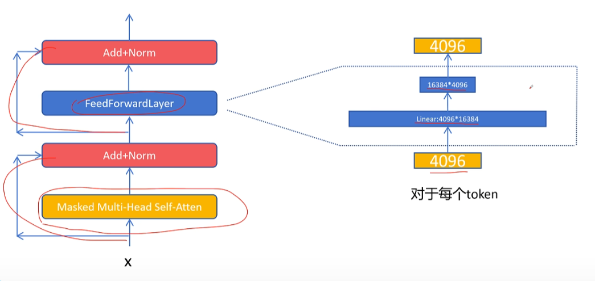
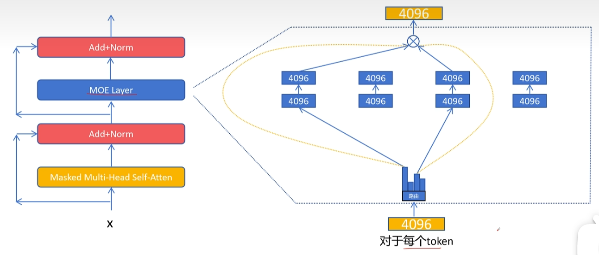
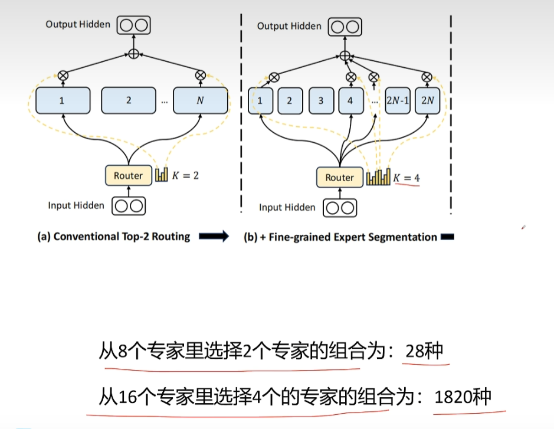
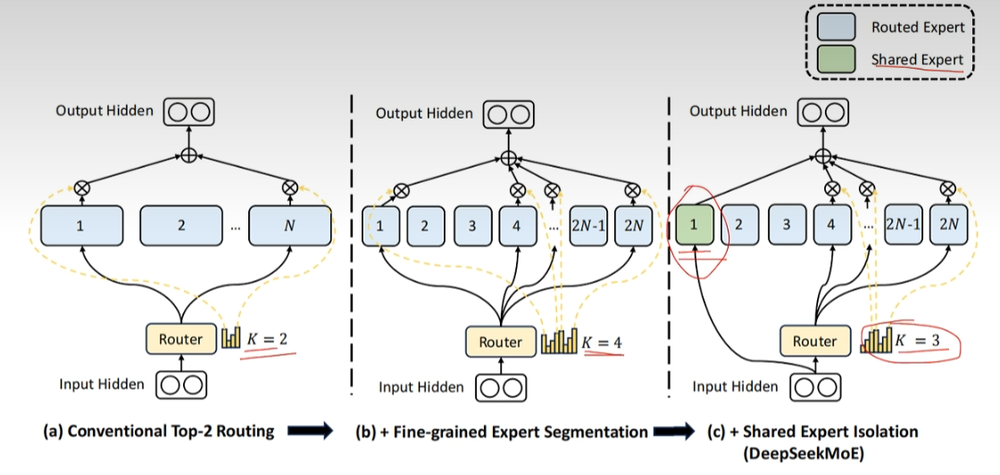

在预训练一个大模型的时候，如果你首先设定一个期望损失，接下来你需要决定模型的参数量，比如你选择一个10B大小的大模型，模型架构为llama架构，为了和MOE大模型有所区分，我们称之前的为稠密（dense）大模型，你也可以选择更大的参数量，比如选择50B的dense大模型，会发现增大大模型参数量，在达到同样的期望效果时，花费的训练代码会更少，但是meta认为虽然在训练时达到同样的预期效果，更大参数量的模型训练花费更少，但是在推理阶段时，更大参数量的模型花费会更大，训练只有一次，但是推理是无数次的，而MOE模型在达到同样期望效果时，训练花费计算代价会更少，而且最终推理时花费的计算代价也非常少。



传统的decoderonly的dense大模型架构如图所示，MOE就是对feedforward进行改造，原始的feedforward很简单，就是一个升维的线形层，比如图中就是升维到16384维度，然后再通过过一个线性层变化为原始的特征维度4096



MOE将原来的feedforward拆分成多个小的feedforward，这时每个小的feedforward的第一层相比dense结构的第一层的维度可以大幅减小，比如从原来的4096\*16384减少为4096\*4096，第二层从原来的16384\*4096减少为4096\*4096，这里每一个小的feedforward就被称为一个专家，对于每个输入的token应该走哪个专家网络呢？这里需要一个路由网络来决定路由网络输出，路由网络输出每个token走不同专家网络的概率值，然后找出其中排名靠前的几个专家，具体选择几个专家，是可调节的超参数，比如选择两个，然后让token的特征通过选择的两个专家网络，得到两个维度为4096的特征向量，然后再根据路由网络输出的专家权重进行加权求和，就是混合专家层最终对于该token的输出了，专家的选择是对每一个token进行的而不是对一个序列。



接下来通过代码来看一下MOE层该如何实现

```python
import torch
from torch import nn

#专家网络的定义，有两个线性层
class ExpertNetwork(nn.Module):
    def __init__(self,hidden_size,intermediate_size):
        super().__init__()
        self.hidden_size=hidden_size
        self.intermediate_size=intermediate_size
        
        self.linear1=nn.Linear(hidden_size,intermediate_size)
        self.linear2=nn.Linear(intermediate_size,hidden_size)
        
    def forward(self,x):
        x=self.linear1(x)
        x=nn.functional.relu(x)
        output=self.linear2(x)
        return output

#路由网络定义，可以认为它就是对多个专家进行分类
class Router(nn.Module):
    def __init__(self,hidden_size,expert_num,top_k):
        super().__init__()
        self.router=nn.Linear(hidden_size,expert_num)
        self.top_k=top_k
        self.hidden_size=hidden_size
        
    def forward(self,x):
        #对输入的形状进行修改，从原来的(batch_size,seq_len,hidden_size)变成(token_num,hidden_size)
        x=x.view(-1,self.hidden_size)#将x以hidden_size为最后一维重整
        x=self.router(x)
        x=nn.functional.softmax(x)#每个专家的选择权重
        topk_weight,topk_idx=torch.topk(x,k=self.topk,dim=-1,sorted=False)
        #对topk权重重新归一化，因为现在topk的权重之和不为1
        topk_weight=topk_weight/topk_weight.sum(dim=-1,keepdim=True)
        return topk_weight,topk_idx
    
class MOELayer(nn.Module):
    def __init__(self,hidden_size,intermediate_size,expert_num,top_k):
        super().__init__()
        self.hidden_size=hidden_size
        self.intermediate_size=intermediate_size
        self.expert_num=expert_num
        self.top_k=top_k
        self.experts=nn.ModuleList(
            [ExpertNetwork(self.hidden_size,self.intermediate_size) for _ in range(self.expert_num)]
        )
        self.router=Router(self.hidden_size,self.expert_num,self.top_k)
        
    def forward(self,x): #x形状(batch_szie,seq_len,hidden_size)
        batch_size,seq_len,_=x.size()
        token_num=batch_size*seq_len
        #改变输入的维度为(token_nums,hidden_size)
        x_flaten=x.view(token_num,self.hidden_size)
        #通过路由获得topk专家选择的权重和索引，形状均为(N,top_k)
        topk_weight,topk_idx=self.router(x)
        #初始化输出张量
        output=torch.zeros_like(x_flat)
        #这里用的是遍历所有token的方式是为了便于理解，其实有更加优雅的方式
        for token_idx in range(token_num):
            #对每个token选择的专家进行循环
            for expert_idx in range(self.top_k):
                #让token通过当前选择的专家
                expert=self.experts[topk_idx[token_idx,expert_idx]]
                #将当前专家输出乘以专家权重加到最终的结果上
                output[token_idx]+=topk_weight[token_idx,expert_idx]*expert(x_flat[token_idx])
        output=output.view(batch_size,seq_len,self.hidden_size)
        return output
    
HIDDEN_SIZE=4096
INTERMEDIATE_SIZE=2048
EXPERT_NUM=8
TOP_K=2

inputs=torch.randn((2,11,4096))
moe_layer=MOELayer(HIDDEN_SIZE,INTERMEDIATE_SIZE,EXPERT_NUM,TOP_K)
outputs=moe_layer(inputs)
print(outputs.size())
```

### MOE特点

- 在相同的计算代价下，MOE可以增大网络参数规模，性能更好。
- 基本可以达到相同参数规模的dense网络性能。
- 相比同等参数规模的dense网络，计算代价更小。
- 相比同等参数规模的dense网络，所有专家网络参数都是要加载在显存中的，所以显存占用不变。
- 可能有专家负载不均衡问题，训练难度增大。可能大量的token都被少数的几个专家处理，而其他专家占用网络参数，但是却很少激活，就好比医院中的冷门科室，没什么活，但是还要领着工资。

为了让MOE模型里的专家负载均衡，有以下解决办法

- 训练时对每个token至少选择2个专家，选择top1专家和在剩余专家里按照权重作为概率再选择一个。
- 给每个专家设置token容量，也就是这个专家在一个batch里能处理最多的token数，达到容量后，则跳过处理，对分配给这个专家的token输出全为0，token就直接通过残差连接下一层了。
- 设置一个负载均衡的辅助损失。

### 负载均衡损失

希望每个专家被调用的概率是相等的，频率fi=(该专家被调用的次数)/(所有专家被调用的次数)
$$
loss_{balance}=\sum_{i=1}^{N}(f_i)^2
$$
假设有两个专家
$$
f_1=1;f_2=0;loss_{balance}=1^2+0^2=1\\
f_1=0.8;f_2=0.2;loss_{balance}=0.8^2+0.2^2=0.68\\
f_1=0.5;f_2=0.5;loss_{balance}=0.5^2+0.5^2=0.5\\
$$
这里可以通过柯西不等式证明负载均衡时损失函数的值最小。

但是这个损失函数并不能直接拿来用，因为我们计算每个专家被调用的频率需要统计每个专家被调用的次数，而每个专家是否被调用，是通过topk操作进行的，topk操作是根据权重进行的一个选择操作，不是数值运算，是不可微的，无法通过梯度下降进行优化，所以有一个近似的做法，就是把频率的平方中的频率fi用概率pi来代替，pi是一个批次中所有token对该专家的路由的概率的平均值，理论上对该专家的路由的平均概率应该等于选择该专家的频率，同时路由的平均概率是通过softmax进行数值计算得到的，是可微的，可以通过梯度下降进行优化，所以最终的损失函数如下所示。
$$
loss_{balance}=\sum_{i=1}^{N}(f_i)^2-->loss_{balance}=\sum_{i=1}^{N}f_ip_i
$$

### DeepSeekMoE：迈向让专家更加专精的MOE语言模型

基础的MOE实现，假设有n个专家，每次选择两个专家，deepseek认为传统的moe设置的专家数太少了，导致没个专家学习了过多彼此不相关的知识，从而不够专精，好比医院里只有两名医生，那每个医生需要掌握的医学领域就太广泛了，deepseek将专家进行更进一步细分，同时每个专家的网络也变小了，将原来的N个专家变成2N个专家，每个专家网络参数也为原来专家的一半，在网络前向传播时，维持了和之前网络同样的计算代价的前提下，就可以激活四个专家。原来从8个专家中选择两个专家的组合为28种，而从16个专家中选择4个专家的组合为1820种，对专家进行细分可以得到更加灵活的专家组合。

所有专家可能都要学习一些基础的通用的能力，是否可以将所有专家都要学习的通用基础能力提取出来作为共享专家，共享专家保证每次都被激活，负责所有专家原来都需要的通用能力，就好比医院中的护理科室，所有科室都需要护理科的能力，那就把护理能力作为一个单独的科室，每个病人都要经过护理科的处理。



DeepSeekMoE的性能已经达到MoE模型的极限，基本与每次都全部激活的Dense网络的性能相当。

### DeepSeekMoE源码实现

```python
class DeepseekMoe(nn.Module):
    '''
    包含共享专家的混合专家模型
    '''
    def __init__(self,config):
        super().__init__()
        self.config=config
        self.num_experts_per_tok=config.num_experts_per_tok
        #定义专家
        self.experts=nn.ModuleList(
            [DeepseekMLP(config,intermediate_size=config.moe_intermediate_size) for i in range(config.n_routed_experts)]
        )
        #定义路由网络
        self.gate=MoEGate(config)
        if config.n_shared_experts is not None:
            intermediate_size=config.moe_intermediate_size*config.n_shared_experts
            #定义共享专家
            self.shared_experts=DeepseekMLP(config,intermediate_size=intermediate_size)
            
    def forward(self,hidden_states):
        identity=hidden_states
        orig_shape=hidden_states.shape
        #经过路由网络得到topk的专家的index和权重以及一个负载均衡的辅助损失
        topk_idx,topk_weight,aus_loss=self.gate(hidden_states)
        flat_topk_idx=topk_idx.view(-1)
        if self.training:
            hidden_states=hidden_states.repeat_interleave(self.num_experts_per_tok,dim=0)
            y=torch.empty_like(hidden_states)
            #对每个专家进行循环
            for i,expert in enumerate(self.experts):
                #提取所有需要该专家处理的token，用该专家一次性进行处理，提升了处理性能
                y[flat_topk_idx==i]=expert(hidden_states[flat_topk_idx==i])
            #乘以专家的路由权重
            y=(y.view(*topk_weight.shape,-1)*topk_weight.unsqueeze(-1)).sum(dim=1)
            y=y.view(*orig_shape)
            #加上辅助负载均衡损失
            y=AddAuxiliaryLoss.apply(y,aux_loss)
        else:
            y=self.moe_infer(hidden_states,flat_topk_idx,topk_weight.view(-1,1)).view(*orig_shape)
        #如果有共享专家
        if self.config.n_shared_experts is not None:
            #在结果上加上共享专家对所有token的处理结果
            y=y+self.shared_experts(identity)
        return y
```

注意：当你的模型从MLP替换成MoE后会发现极大增加了参数量，这是正常的，例如，在MicroCortex模型中使用MLP和使用MoE分别的单层参数量对比如下：

MLP：

```
model.layers.0.mlp.gate_proj.weight                          0.721M (1408, 512)
model.layers.0.mlp.down_proj.weight                          0.721M (512, 1408)
model.layers.0.mlp.up_proj.weight                            0.721M (1408, 512)
总计2.163M
```

MoE

```
model.layers.0.mlp.experts.0.gate_proj.weight                0.721M (1408, 512)
model.layers.0.mlp.experts.0.down_proj.weight                0.721M (512, 1408)
model.layers.0.mlp.experts.0.up_proj.weight                  0.721M (1408, 512)
model.layers.0.mlp.experts.1.gate_proj.weight                0.721M (1408, 512)
model.layers.0.mlp.experts.1.down_proj.weight                0.721M (512, 1408)
model.layers.0.mlp.experts.1.up_proj.weight                  0.721M (1408, 512)
model.layers.0.mlp.experts.2.gate_proj.weight                0.721M (1408, 512)
model.layers.0.mlp.experts.2.down_proj.weight                0.721M (512, 1408)
model.layers.0.mlp.experts.2.up_proj.weight                  0.721M (1408, 512)
model.layers.0.mlp.experts.3.gate_proj.weight                0.721M (1408, 512)
model.layers.0.mlp.experts.3.down_proj.weight                0.721M (512, 1408)
model.layers.0.mlp.experts.3.up_proj.weight                  0.721M (1408, 512)
model.layers.0.mlp.gate.weight                               0.002M (4, 512)
model.layers.0.mlp.shared_experts.0.gate_proj.weight         0.721M (1408, 512)
model.layers.0.mlp.shared_experts.0.down_proj.weight         0.721M (512, 1408)
model.layers.0.mlp.shared_experts.0.up_proj.weight           0.721M (1408, 512)
总计：10.817M
```

每一层相差8.654，总共8层的情况下，仅仅MoE层就增加了69.232M的参数
